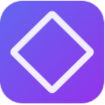
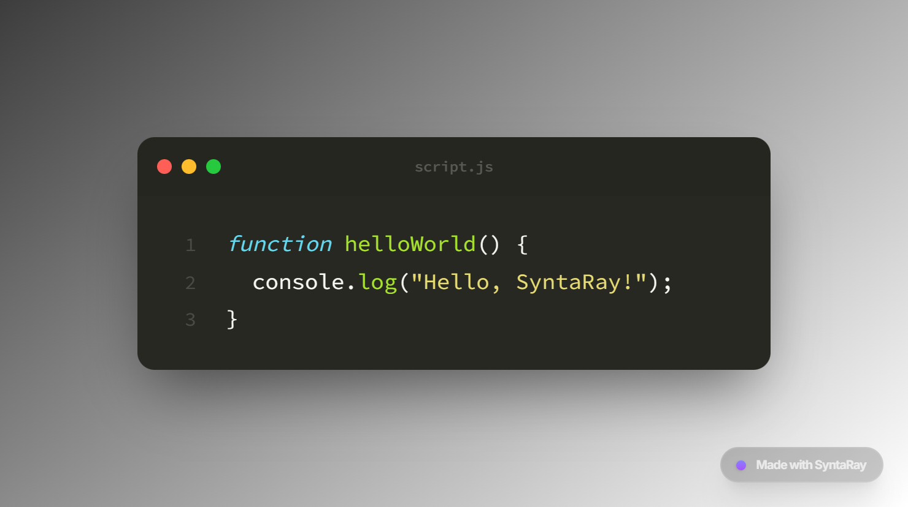
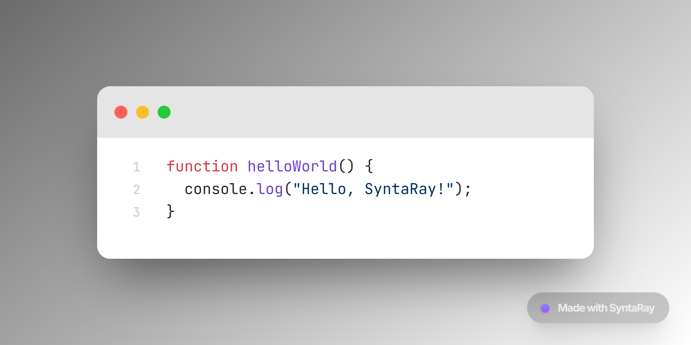

<div align="center">



# ✨ SyntaRay

[](https://github.com/ayazdoruck/syntaray/actions/workflows/ci.yml)

### Transform Your Code into Beautiful Snapshots

[](https://syntaray.vercel.app)
[](https://nextjs.org)
[](https://www.typescriptlang.org/)

[Features](#-features) • [Tech Stack](#-tech-stack) • [Quick Start](#-quick-start) • [Screenshots](#-screenshots) • [Contact](#-contact)

</div>

---

## 🎯 Features

<table>
<tr>
<td width="50%">

### 🎨 **Visual Customization**
- 🌓 **Dual Themes** - Seamless Light/Dark mode switching
- 🖼️ **Custom Backgrounds** - Gradients, solid colors, or image uploads
- 🪟 **Window Styles** - macOS, Windows, Gray, or Minimal frames
- ✨ **Premium Animations** - Smooth transitions and micro-interactions

</td>
<td width="50%">

### ⚙️ **Precision Controls**
- 📐 **Dimension Control** - Adjust frame and editor sizes precisely
- 🎭 **40+ Syntax Themes** - From One Dark Pro to Tokyo Night
- 🔤 **Typography** - Custom fonts, spacing, and line heights
- 💾 **Auto-Save** - Settings persist across sessions

</td>
</tr>
</table>

### 🚀 **Advanced Features**

- **Real-time Syntax Highlighting** - Powered by Shiki with 25+ language support
- **Smart Contrast** - Auto-adjusting text colors for optimal readability
- **Multiple Export Formats** - PNG, JPG, WebP, and SVG
- **Glassmorphism Effects** - Modern blur and opacity controls
- **Line Highlighting** - Focus on specific code sections
- **Custom Watermarks** - Add your personal branding

---

## 🛠️ Tech Stack

<div align="center">


**Core:** Next.js 15 • React 19 • TypeScript  
**Styling:** Tailwind CSS • CSS3 Animations  
**State:** Zustand with Persistence  
**Syntax:** Shiki Highlighter  
**Export:** html-to-image  
**Icons:** Lucide React

</div>

---

## 🚀 Quick Start

```bash
# Clone the repository
git clone https://github.com/ayazdoruck/syntaray.git
cd syntaray

# Install dependencies
npm install

# Start development server
npm run dev
```

Open [http://localhost:3000](http://localhost:3000) in your browser.

### 📦 Build for Production

```bash
npm run build
npm start
```

---

## 📸 Screenshots

<div align="center">

### 🌙 Dark Mode - One Dark Pro Theme


<br/><br/>

### ☀️ Light Mode - Custom Gradient


</div>

---

## 🎨 Supported Languages

<div align="center">


**And many more!** Auto-detection for 25+ programming languages.

</div>

---

## 🤝 Contributing

Contributions are welcome! Feel free to:

1. 🍴 Fork the repository
2. 🔨 Create a feature branch (`git checkout -b feature/amazing-feature`)
3. 💾 Commit your changes (`git commit -m 'Add amazing feature'`)
4. 📤 Push to the branch (`git push origin feature/amazing-feature`)
5. 🎉 Open a Pull Request

---

## 📞 Contact

<div align="center">

[](https://discordapp.com/users/pahiy)
[](https://instagram.com/ayazdoruck)
[](https://github.com/ayazdoruck)

</div>

---

## 📄 License

This project is open source and available under the [MIT License](LICENSE).

---

<div align="center">

### 💜 Built with passion by [@ayazdoruck](https://github.com/ayazdoruck)

**If you found this helpful, consider giving it a ⭐**

[⬆ Back to Top](#-syntaray)

</div>

## License

[MIT](LICENSE)
